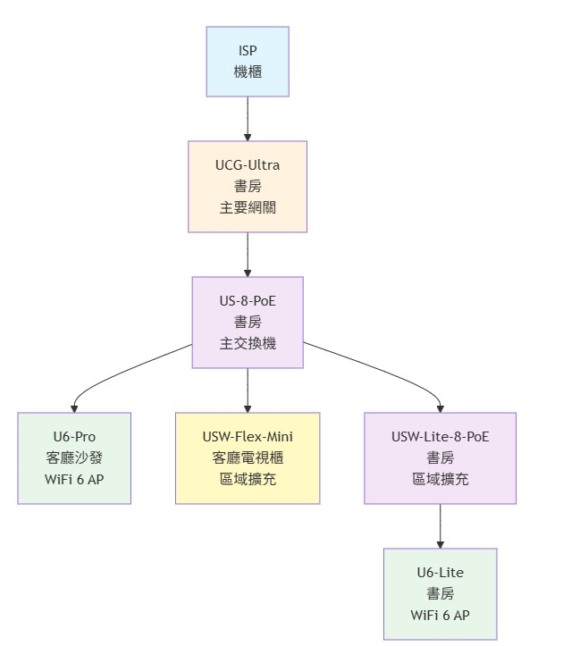

# 🏠 家庭網路拓撲 / Home Network Topology

> UniFi 全家桶網路架構文件

## 📊 網路拓撲圖

## 🖥️ 設備清單

### 核心網路設備

| 設備型號 | 位置 | 功能 | 備註 |
|---------|------|------|------|
| 🌐 **UCG-Ultra** (UniFi Cloud Gateway Ultra) | 📍 書房 | 主要網關/路由器 | 核心控制器 |
| 🔌 **US-8-PoE** | 📍 書房 | 8埠 PoE 主交換機 | 連接 UCG-Ultra |
| 🔌 **USW-Lite-8-PoE** | 📍 書房 | 8埠 PoE 交換機 | 書房區域擴充 |
| 🔗 **USW-Flex-Mini** | 📍 客廳電視櫃 | 5埠交換機 | 客廳區域擴充 |

### 無線存取點 (AP)

| 設備型號 | 位置 | 規格 | 供電方式 |
|---------|------|------|---------|
| 📡 **U6-Pro** | 📍 客廳沙發 | WiFi 6 | ⚡ PoE (US-8-PoE) |
| 📡 **U6-Lite** | 📍 書房 | WiFi 6 | ⚡ PoE (USW-Lite-8-PoE) |

## 🏘️ 區域配置

### 📚 書房 (核心區域)
- **網路設備**: UCG-Ultra、US-8-PoE、USW-Lite-8-PoE
- **無線覆蓋**: U6-Lite
- **用途**: 網路核心設備管理、Home Assistant 主機

### 🛋️ 客廳 (娛樂區域)
- **網路設備**: USW-Flex-Mini
- **無線覆蓋**: U6-Pro
- **用途**: 娛樂設備、智慧家居設備

## ✨ 架構特色

- ✅ **集中管理**: 核心設備集中於書房,便於維護
- ✅ **充足供電**: 兩台 PoE 交換機提供足夠的 PoE 埠
- ✅ **全屋覆蓋**: 雙 WiFi 6 AP 配置提供完整覆蓋
- ✅ **擴充彈性**: 多台交換機提供充足的有線埠
- ✅ **UniFi 生態**: 統一管理介面

## 🏡 Home Assistant 整合

### 規劃中的設備
- 🌡️ **溫濕度感測器**: SONOFF SNZB-02 系列 / Aqara
- 💡 **智慧燈泡**: Philips Wiz
- 🔌 **智慧開關**: SONOFF Basic WW1-AC (Tasmota)
- 📹 **監控攝影機**: UniFi Protect (需額外儲存設備)

### 整合方式
- **Zigbee 網路**: Zigbee2MQTT
- **控制中心**: Home Assistant (部署於書房)

## 🔒 安全性措施

- [ ] 建立獨立的 IoT VLAN
- [ ] 設定 IoT 專用 WiFi 網路
- [ ] 限制 IoT 設備與主網路互通
- [ ] 啟用 UniFi IDS/IPS 功能
- [ ] 定期更新設備韌體

## 📝 相關連結

- [UniFi 官方網站](https://ui.com/)
- [Home Assistant](https://www.home-assistant.io/)
- [Zigbee2MQTT](https://www.zigbee2mqtt.io/)

---

**📅 最後更新 / Last Updated**: 2025-11-17  
**👤 維護者 / Maintainer**: [@hammernatsu](https://github.com/hammernatsu)

Made with ❤️ for Smart Home

[🔧 查看開發版本 (dev branch)](../../tree/dev)

