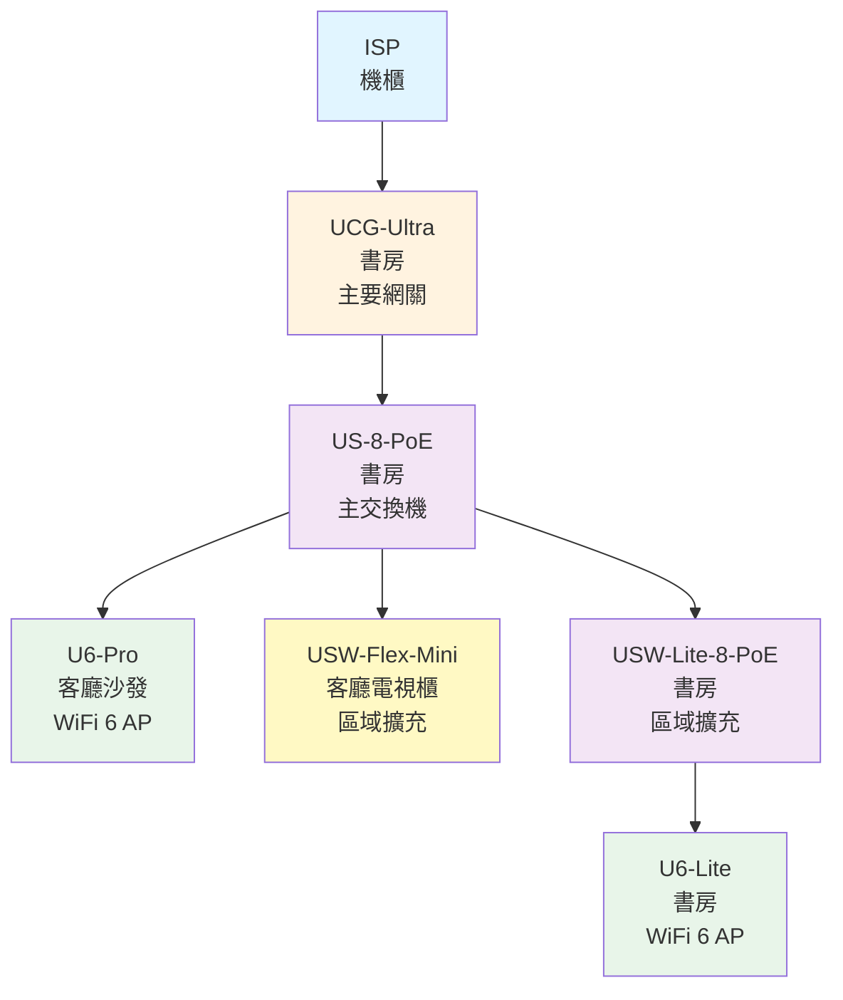

# 🏠 豐河小窩的網路拓撲 / Home Network Topology

> UniFi 網路架構文件

## 📊 網路拓撲圖



<details>
<summary>純文字版拓撲圖</summary>

```
ISP (機櫃)
  ↓
UCG-Ultra (書房) - 主要網關
  ↓
US-8-PoE (書房) - 主交換機
  ├─ U6-Pro (客廳沙發) - PoE 供電
  ├─ USW-Flex-Mini (客廳電視櫃) - 客廳區域擴充
  └─ USW-Lite-8-PoE (書房) - 書房區域擴充
      └─ U6-Lite (書房) - PoE 供電
```

</details>

## 🖥️ 設備清單

### 核心網路設備

| 設備型號 | 位置 | 功能 | 備註 |
|---------|------|------|------|
| 🌐 **UCG-Ultra**<br/>(UniFi Cloud Gateway Ultra) | 📍 書房 | 主要網關/路由器 | 核心控制器 |
| 🔌 **US-8-PoE** | 📍 書房 | 8埠 PoE 主交換機 | 連接 UCG-Ultra |
| 🔌 **USW-Lite-8-PoE** | 📍 書房 | 8埠 PoE 交換機 | 書房區域擴充 |
| 🔗 **USW-Flex-Mini** | 📍 客廳電視櫃 | 5埠交換機 | 客廳區域擴充 |

### 無線存取點 (AP)

| 設備型號 | 位置 | 規格 | 供電方式 |
|---------|------|------|---------|
| 📡 **U6-Pro** | 📍 客廳沙發 | WiFi 6 | ⚡ PoE (US-8-PoE) |
| 📡 **U6-Lite** | 📍 書房 | WiFi 6 | ⚡ PoE (USW-Lite-8-PoE) |

## 🏘️ 區域配置

### 📚 書房 (核心區域)
- **網路設備**: UCG-Ultra、US-8-PoE、USW-Lite-8-PoE
- **無線覆蓋**: U6-Lite
- **用途**: 網路核心設備管理、Home Assistant 主機

### 🛋️ 客廳 (娛樂區域)
- **網路設備**: USW-Flex-Mini
- **無線覆蓋**: U6-Pro
- **用途**: 娛樂設備、智慧家居設備
---

<div align="center">

**📅 最後更新 / Last Updated**: 2025-11-17  
<!-- 👤 維護者 / Maintainer**: [@hammernatsu](https://github.com/hammernatsu) -->
</div>